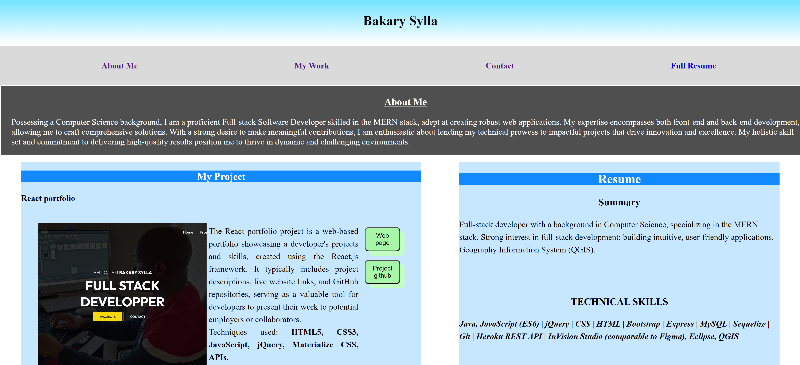

# My Resume Portfolio

## Table of Contents:

    1. Project Overview
    2. Descriptions
    3. Technologies Used
    4. Usage
    5. App Screenshots
    6. Github
    7. Question

## Project Overview

`This project involves the creation of a responsive web page that serves as a portfolio for potential employees. The primary objective is to showcase a developer's previous work in a user-friendly and visually appealing manner. The implementation leverages HTML and CSS to create a dynamic and adaptable user experience.`

## Description

```
Portfolio Presentation: Upon loading the portfolio, users are greeted with vital information about the developer, including their name, a recent photo or avatar, and links to sections offering in-depth insights into their profile, work, and contact details.

Effortless Navigation: Clicking any link in the navigation menu results in a seamlessly responsive scrolling experience, ensuring smooth transitions to the corresponding sections.

Work Showcase: The "Work" section is thoughtfully designed to highlight the developer's applications with titled images, creating an engaging and accessible display.

Visual Hierarchy: The developer's primary application is prominently featured with a larger image size compared to the others, providing clear visual hierarchy.

Application Access: By clicking on the application images, users are effortlessly directed to the deployed versions of each application for further exploration.

Responsive Design: This web page is intentionally designed to be responsive, adapting gracefully to various screen sizes and devices. Whether viewed on a desktop, tablet, or smartphone, the user experience remains consistent and engaging.
```

## Technologies Used

```
HTML: Used for structuring the content and layout of the responsive webpage.
CSS: Employed for styling and ensuring a visually appealing and responsive design.
```

## Usage

To access the website, simply [visit my website](https://abou2022.github.io/MyResume/). Feel free to resize the page or view it on various screens and devices to observe the responsive layout in action.

## App Screenshots




## Github

You are encouraged to make contributions to this project by submitting a Git pull request on my [Github](https://github.com/Abou2022/my-portfolio). Your suggestions and contributions will be warmly welcomed and appreciated. Thank you for your valuable input and support.

## Email

Should you have any questions, please don't hesitate to reach out via email my [Email](mailto:syllabakary2002@gmail.com). Your inquiries are welcome, and I'm here to assist you.

<!-- [Email](mailto:syllabakary2002@gmail.com) -->

---

© 2023 Bakary sylla, Inc. brand. Confidential and Proprietary. All Rights Reserved.
